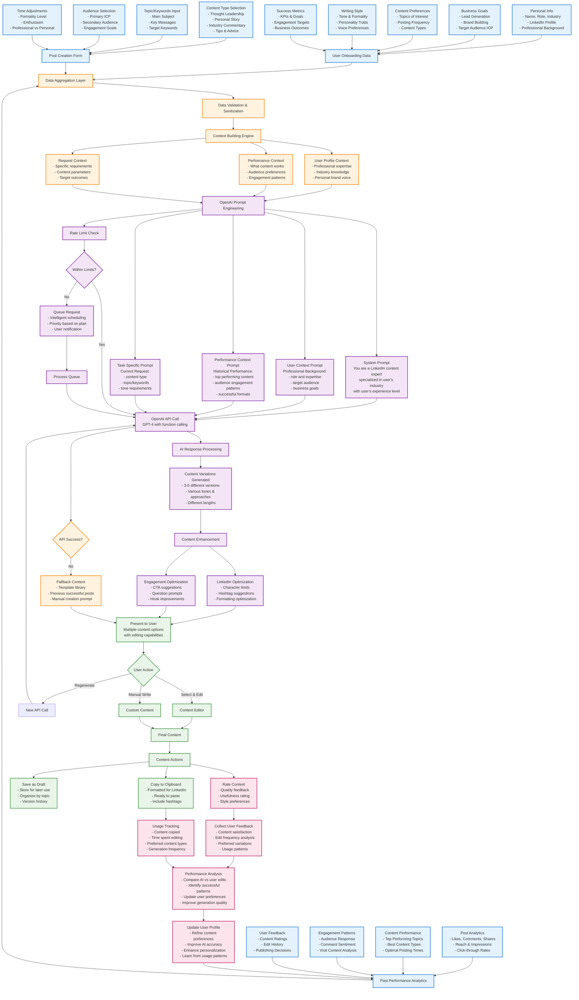

```mermaid
graph TD
    %% Data Sources
    A[User Onboarding Data] --> D[Data Aggregation Layer]
    B[Post Creation Form] --> D
    C[Past Performance Analytics] --> D

    %% Onboarding Data Details
    A1["Personal Info<br/>- Name, Role, Industry<br/>- LinkedIn Profile<br/>- Professional Background"] --> A
    A2["Business Goals<br/>- Lead Generation<br/>- Brand Building<br/>- Target Audience ICP"] --> A
    A3["Content Preferences<br/>- Topics of Interest<br/>- Posting Frequency<br/>- Content Types"] --> A
    A4["Writing Style<br/>- Tone & Formality<br/>- Personality Traits<br/>- Voice Preferences"] --> A
    A5["Success Metrics<br/>- KPIs & Goals<br/>- Engagement Targets<br/>- Business Outcomes"] --> A

    %% Post Creation Form Data
    B1["Content Type Selection<br/>- Thought Leadership<br/>- Personal Story<br/>- Industry Commentary<br/>- Tips & Advice"] --> B
    B2["Topic/Keywords Input<br/>- Main Subject<br/>- Key Messages<br/>- Target Keywords"] --> B
    B3["Audience Selection<br/>- Primary ICP<br/>- Secondary Audience<br/>- Engagement Goals"] --> B
    B4["Tone Adjustments<br/>- Formality Level<br/>- Enthusiasm<br/>- Professional vs Personal"] --> B

    %% Past Performance Data
    C1["Post Analytics<br/>- Likes, Comments, Shares<br/>- Reach & Impressions<br/>- Click-through Rates"] --> C
    C2["Content Performance<br/>- Top Performing Topics<br/>- Best Content Types<br/>- Optimal Posting Times"] --> C
    C3["Engagement Patterns<br/>- Audience Response<br/>- Comment Sentiment<br/>- Viral Content Analysis"] --> C
    C4["User Feedback<br/>- Content Ratings<br/>- Edit History<br/>- Publishing Decisions"] --> C

    %% Data Processing
    D --> E[Data Validation & Sanitization]
    E --> F[Context Building Engine]

    %% Context Building
    F --> G["User Profile Context<br/>- Professional expertise<br/>- Industry knowledge<br/>- Personal brand voice"]
    F --> H["Performance Context<br/>- What content works<br/>- Audience preferences<br/>- Engagement patterns"]
    F --> I["Request Context<br/>- Specific requirements<br/>- Content parameters<br/>- Target outcomes"]

    %% OpenAI Integration
    G --> J[OpenAI Prompt Engineering]
    H --> J
    I --> J

    J --> K["System Prompt<br/>You are a LinkedIn content expert<br/>specialized in user's industry<br/>with user's experience level"]

    J --> L["User Context Prompt<br/>Professional Background:<br/>- role and expertise<br/>- target audience<br/>- business goals"]

    J --> M["Performance Context Prompt<br/>Historical Performance:<br/>- top performing content<br/>- audience engagement patterns<br/>- successful formats"]

    J --> N["Task Specific Prompt<br/>Current Request:<br/>- content type<br/>- topic/keywords<br/>- tone requirements"]

    %% API Call
    K --> O["OpenAI API Call<br/>GPT-4 with function calling"]
    L --> O
    M --> O
    N --> O

    %% Response Processing
    O --> P[AI Response Processing]
    P --> Q["Content Variations Generated<br/>- 3-5 different versions<br/>- Various tones & approaches<br/>- Different lengths"]

    Q --> R[Content Enhancement]
    R --> S["LinkedIn Optimization<br/>- Character limits<br/>- Hashtag suggestions<br/>- Formatting optimization"]
    R --> T["Engagement Optimization<br/>- CTA suggestions<br/>- Question prompts<br/>- Hook improvements"]

    %% User Interface
    S --> U["Present to User<br/>Multiple content options<br/>with editing capabilities"]
    T --> U

        %% User Actions & Feedback Loop
    U --> V{User Action}
    V -->|Select & Edit| W[Content Editor]
    V -->|Regenerate| X[New API Call] --> O
    V -->|Manual Write| Y[Custom Content]

    W --> Z[Final Content]
    Y --> Z
    Z --> AA["Content Actions"]

    AA --> BB["Copy to Clipboard<br/>- Formatted for LinkedIn<br/>- Ready to paste<br/>- Include hashtags"]
    AA --> DD["Save as Draft<br/>- Store for later use<br/>- Organize by topic<br/>- Version history"]
    AA --> EE["Rate Content<br/>- Quality feedback<br/>- Usefulness rating<br/>- Style preferences"]

    %% User Feedback & Learning
    EE --> FF["Collect User Feedback<br/>- Content satisfaction<br/>- Edit frequency analysis<br/>- Preferred variations<br/>- Usage patterns"]

    BB --> GG["Usage Tracking<br/>- Content copied<br/>- Time spent editing<br/>- Preferred content types<br/>- Generation frequency"]

    FF --> HH["Performance Analysis<br/>- Compare AI vs user edits<br/>- Identify successful patterns<br/>- Update user preferences<br/>- Improve generation quality"]

    GG --> HH

    HH --> II["Update User Profile<br/>- Refine content preferences<br/>- Improve AI accuracy<br/>- Enhance personalization<br/>- Learn from usage patterns"]

    II --> C

    %% Error Handling & Fallbacks
    O --> JJ{API Success?}
    JJ -->|No| KK["Fallback Content<br/>- Template library<br/>- Previous successful posts<br/>- Manual creation prompt"]
    KK --> U

    %% Rate Limiting & Queue Management
    J --> LL[Rate Limit Check]
    LL --> MM{Within Limits?}
    MM -->|No| NN["Queue Request<br/>- Intelligent scheduling<br/>- Priority based on plan<br/>- User notification"]
    MM -->|Yes| O
    NN --> OO[Process Queue] --> O

    %% Styling
    classDef dataSource fill:#e3f2fd,stroke:#1976d2,stroke-width:2px
    classDef processing fill:#fff3e0,stroke:#f57c00,stroke-width:2px
    classDef aiIntegration fill:#f3e5f5,stroke:#7b1fa2,stroke-width:2px
    classDef userInterface fill:#e8f5e8,stroke:#388e3c,stroke-width:2px
    classDef feedback fill:#fce4ec,stroke:#c2185b,stroke-width:2px

    class A,B,C,A1,A2,A3,A4,A5,B1,B2,B3,B4,C1,C2,C3,C4 dataSource
    class D,E,F,G,H,I processing
    class J,K,L,M,N,O,P,Q,R,S,T,LL,MM,NN,OO aiIntegration
    class U,V,W,Y,Z,AA,BB,DD userInterface
    class EE,FF,GG,HH,II feedback
    class JJ,KK processing
```
