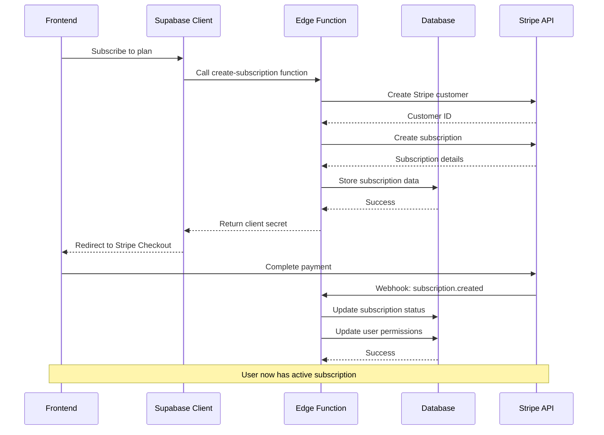

```mermaid
sequenceDiagram
    participant F as Frontend
    participant SC as Supabase Client
    participant EF as Edge Function
    participant DB as Database
    participant S as Stripe API
    
    F->>SC: Subscribe to plan
    SC->>EF: Call create-subscription function
    EF->>S: Create Stripe customer
    S-->>EF: Customer ID
    
    EF->>S: Create subscription
    S-->>EF: Subscription details
    
    EF->>DB: Store subscription data
    DB-->>EF: Success
    
    EF-->>SC: Return client secret
    SC-->>F: Redirect to Stripe Checkout
    
    F->>S: Complete payment
    S->>EF: Webhook: subscription.created
    EF->>DB: Update subscription status
    
    EF->>DB: Update user permissions
    DB-->>EF: Success
    
    Note over F,S: User now has active subscription
```