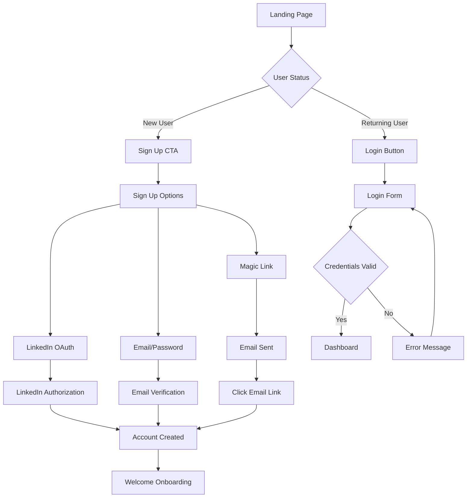
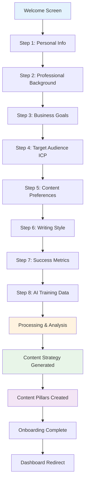
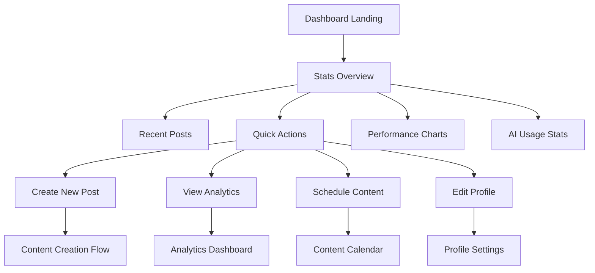
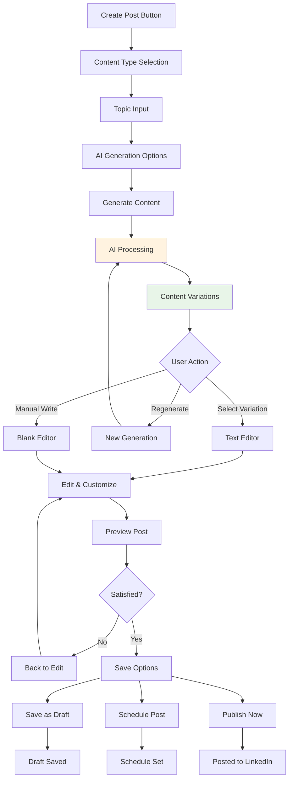
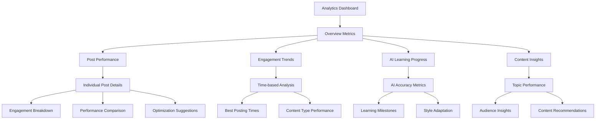
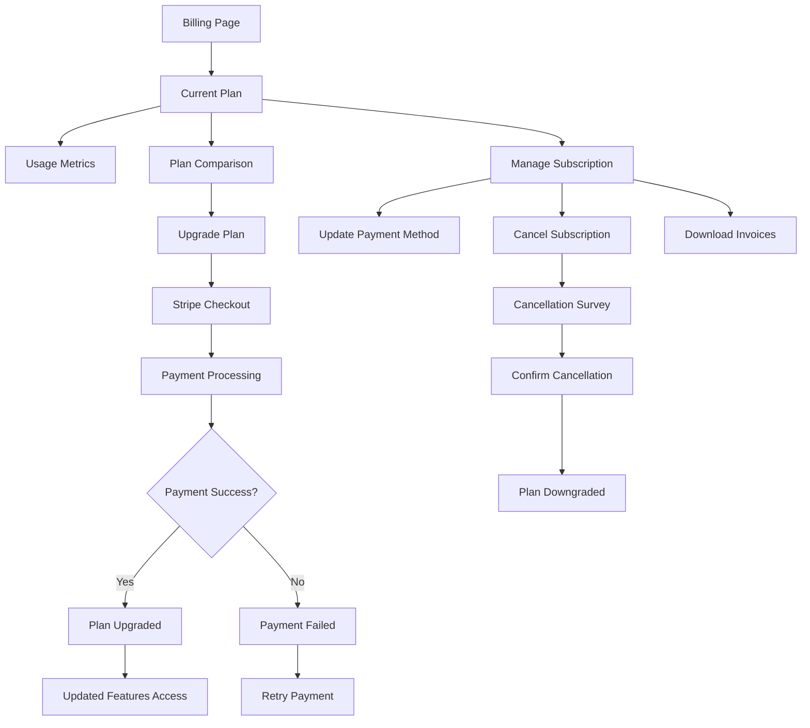

# Mylance - AI-Powered LinkedIn Content Creation Platform

## 🎯 Project Overview

### What is Mylance?

Mylance is an intelligent LinkedIn content creation platform designed specifically for professionals, consultants, and fractional executives who want to build their personal brand and generate leads through consistent, high-quality LinkedIn content. The platform uses AI to learn from users' expertise, writing style, and business goals to generate authentic, engaging LinkedIn posts that feel personal and professional. Users manually copy and post content to LinkedIn, then track performance to help the AI learn and improve future content generation.

### The Problem We're Solving

- **Inconsistent Content Creation**: Professionals struggle to post regularly on LinkedIn due to time constraints
- **Generic Content**: Most LinkedIn posts feel templated and don't reflect the author's unique expertise
- **Writer's Block**: Difficulty knowing what to write about or how to position expertise
- **Time Investment**: Hours spent crafting posts with little engagement or results
- **Authenticity vs. Efficiency**: Balancing personal voice with scalable content creation
- **Lead Generation Gap**: Having expertise but struggling to convert LinkedIn presence into business opportunities
- **Performance Optimization**: Lack of systematic approach to improve content based on actual performance data

### What We Want to Achieve

- **Personalized AI Content Generation**: Create LinkedIn posts that sound like they were written by the user
- **Manual Control**: Users maintain full control over when and how content is posted to LinkedIn
- **Performance-Based Learning**: AI improves by analyzing actual post performance data provided by users
- **Strategic Content Planning**: Help users develop content pillars and strategies aligned with their business goals
- **Data-Driven Optimization**: Track engagement and optimize content strategy based on real performance metrics
- **Subscription-Based Business**: Scalable SaaS model with tiered pricing for different user needs

## 🚀 Core Features & Functionality

### 1. User Onboarding & Profile Building

- **Magic Link Authentication**: Secure, passwordless signup using email magic links
- **Comprehensive Questionnaire**: 8-10 strategic questions to understand:
  - Professional background and expertise
  - Target audience (ICP - Ideal Customer Profile)
  - Business goals and pain points
  - Content preferences and writing style
  - Success metrics and KPIs
- **AI Profile Analysis**: Process user responses to create personalized content strategy
- **Content Pillars Generation**: Develop 3-5 main themes for consistent content creation

### 2. AI-Powered Content Creation

- **Context-Aware Generation**: AI understands user's industry, expertise, and audience
- **4-Tier Prompt System**: Strategic approach from onboarding to individual posts
  - **Type 1**: Content strategy generation from user profile
  - **Type 2**: Content pillars creation (3 strategic themes)
  - **Type 3**: Content prompts generation (30 specific, actionable prompts)
  - **Type 4**: Individual post creation from selected prompts
- **Multiple Content Types**:
  - Professional insights and thought leadership
  - Personal stories with business lessons
  - Industry commentary and trends
  - Tips and actionable advice
  - Question posts for engagement
- **Tone Customization**: Adjust formality, enthusiasm, and personality
- **Length Optimization**: Generate content optimized for LinkedIn's algorithm
- **Variation Options**: Multiple versions of the same concept for A/B testing

> **Note**: Detailed prompt documentation available in `.cursor/prompts.md`

### 3. Content Management & Manual Posting

- **Rich Text Editor**: Professional editing interface with formatting options
- **Copy-to-Clipboard**: Easy copying of generated content for manual posting to LinkedIn
- **Draft Management**: Save, organize, and revisit draft content
- **Usage Tracking**: Mark posts as "used" when manually posted to LinkedIn
- **Template Library**: Pre-built frameworks for common post types
- **Version History**: Track changes and revert to previous versions

### 4. Manual Performance Tracking & AI Learning

- **Manual Metrics Entry**: Users manually input LinkedIn post performance (impressions, likes, comments, shares)
- **Performance Analysis**: Track which content types and topics perform best
- **AI Learning System**: AI analyzes performance data to optimize future content generation
- **Performance Trends**: Identify patterns in successful content over time
- **Content Optimization**: AI suggestions based on actual performance data
- **Learning Progress**: Visualize how the AI improves with more performance data

### 5. Subscription & Billing Management

- **Tiered Pricing Plans**:
  - **Starter**: Basic AI generation (10 posts/month)
  - **Professional**: Advanced features (50 posts/month)
  - **Enterprise**: White-label and team features
- **Stripe Integration**: Secure payment processing
- **Usage Tracking**: Monitor API usage and feature access
- **Billing History**: Transparent invoicing and payment records

## 🎨 Complete UI/UX Flow

### Landing Page Flow

### Onboarding Flow

### Main Dashboard Flow

### Content Creation Flow

### Analytics Flow

### Subscription Flow

## 📱 Detailed Page Descriptions

### 1. Landing Page

**Purpose**: Convert visitors into users
**Key Elements**:

- Hero section with clear value proposition
- Social proof (testimonials, user count)
- Feature highlights with screenshots
- Pricing preview
- Strong CTA buttons
- FAQ section

### 2. Authentication Pages

**Login Page**:

- LinkedIn OAuth (primary)
- Email/password form
- Magic link option
- "Remember me" checkbox
- Password reset link

**Sign Up Page**:

- LinkedIn OAuth (primary)
- Email registration form
- Terms acceptance
- Privacy policy link
- Account verification process

### 3. Onboarding Wizard

**Progressive Disclosure**: 8 steps with clear progress indication

- **Personal Info**: Name, LinkedIn profile, avatar
- **Professional Background**: Role, company, industry, experience
- **Business Goals**: Lead generation, brand building, networking
- **Target Audience**: ICP definition, demographics, pain points
- **Content Preferences**: Topics, frequency, content types
- **Writing Style**: Tone, formality, personality traits
- **Success Metrics**: KPIs, engagement goals, business outcomes
- **AI Training**: Upload sample content, LinkedIn post history

### 4. Main Dashboard

**Layout**: Clean, card-based design with clear hierarchy

- **Header**: User avatar, notifications, quick actions
- **Stats Row**: Posts created, engagement rate, AI usage, growth metrics
- **Main Content**:
  - Recent posts with performance indicators
  - Quick action buttons (Create, Schedule, Analyze)
  - Performance chart (last 30 days)
  - Upcoming scheduled posts
- **Sidebar**: Navigation, AI learning progress, usage limits

### 5. Content Creation Interface

**Two-Panel Layout**:

- **Left Panel**: Generation controls
  - Content type selector
  - Topic/keyword input
  - Tone adjustment sliders
  - Target audience selector
  - Generate button with loading states
- **Right Panel**: Editor and preview
  - Rich text editor with formatting
  - Character count with LinkedIn limits
  - Hashtag suggestions
  - Preview mode toggle
  - Save/schedule/publish options

### 6. Analytics Dashboard

**Multi-Tab Interface**:

- **Overview**: High-level metrics and trends
- **Posts**: Individual post performance analysis
- **Audience**: Engagement patterns and demographics
- **AI Insights**: Learning progress and accuracy metrics
- **Recommendations**: Data-driven content suggestions

### 7. Profile & Settings

**Tabbed Organization**:

- **Profile**: Personal information, LinkedIn connection
- **Writing Profile**: AI preferences, content pillars
- **Account Settings**: Notifications, privacy, data export
- **Integrations**: LinkedIn, other social platforms
- **Billing**: Subscription management, usage tracking

## 🔧 Technical Implementation Strategy

### Phase 1: Foundation (Weeks 1-4)

1. **Project Setup**: Next.js, TypeScript, Tailwind, Supabase
2. **Authentication**: LinkedIn OAuth, magic links, session management
3. **Database Design**: User tables, profiles, posts, analytics
4. **Basic UI**: Landing page, auth flows, dashboard shell

### Phase 2: Core Features (Weeks 5-8)

1. **Onboarding**: Multi-step wizard, data collection, profile building
2. **Content Creation**: AI integration, text editor, draft management
3. **Post Management**: CRUD operations, scheduling, publishing
4. **Basic Analytics**: Engagement tracking, performance metrics

### Phase 3: Advanced Features (Weeks 9-12)

1. **AI Optimization**: Learning algorithms, personalization
2. **Advanced Analytics**: Insights, recommendations, reporting
3. **Subscription System**: Stripe integration, billing management
4. **Performance Optimization**: Caching, database optimization

### Phase 4: Polish & Launch (Weeks 13-16)

1. **UI/UX Refinement**: Design polish, animations, responsiveness
2. **Testing**: Unit tests, integration tests, user acceptance testing
3. **Documentation**: User guides, API docs, help center
4. **Deployment**: Production setup, monitoring, launch preparation

## 🎯 Success Metrics

### User Engagement

- **Onboarding Completion Rate**: Target 80%+
- **Daily Active Users**: Growth trajectory
- **Content Creation Frequency**: Posts per user per month
- **Feature Adoption**: Usage of advanced features

### Content Quality

- **AI Accuracy Score**: User satisfaction with generated content
- **Edit Distance**: How much users modify AI-generated content
- **Publishing Rate**: Percentage of generated content that gets published
- **Engagement Performance**: LinkedIn metrics for published content

### Business Metrics

- **Conversion Rate**: Free to paid subscription
- **Monthly Recurring Revenue (MRR)**: Growth and stability
- **Customer Lifetime Value (CLV)**: Long-term user value
- **Churn Rate**: User retention and satisfaction

### Technical Performance

- **Page Load Speed**: < 2 seconds for all pages
- **AI Generation Time**: < 10 seconds average
- **Uptime**: 99.9% availability target
- **Error Rate**: < 1% of requests

## 🛡️ Risk Mitigation

### Technical Risks

- **AI API Reliability**: Implement fallback content generation
- **Rate Limiting**: Intelligent queuing and caching strategies
- **Data Loss**: Comprehensive backup and recovery procedures
- **Security Breaches**: Regular security audits and penetration testing

### Business Risks

- **Competition**: Focus on personalization and user experience
- **Market Changes**: Flexible architecture for platform expansion
- **User Adoption**: Extensive user testing and feedback integration
- **Revenue Model**: Multiple monetization strategies and pricing experiments

This comprehensive project overview provides the foundation for building Mylance into a market-leading LinkedIn content creation platform that truly understands and serves its users' needs.
