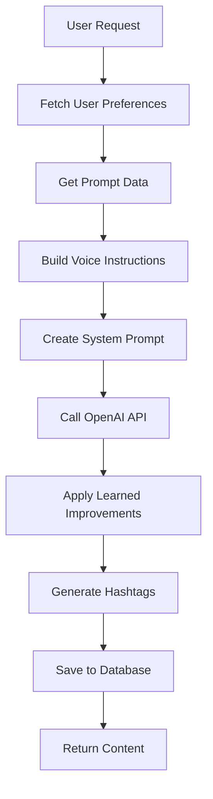
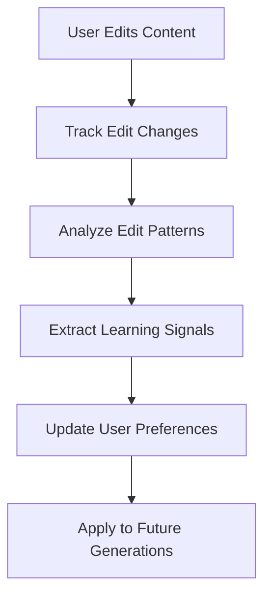
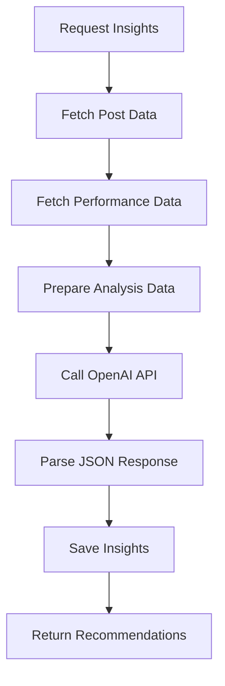

# Mylance AI Integration Documentation

## Overview

Mylance is an AI-powered LinkedIn content creation platform that leverages OpenAI's GPT models extensively throughout the application. This document provides a comprehensive overview of all AI integrations, their purposes, implementation details, and data flow.

## Table of Contents

1. [AI Architecture Overview](#ai-architecture-overview)
2. [OpenAI Configuration](#openai-configuration)
3. [Core AI Services](#core-ai-services)
4. [API Endpoints with AI](#api-endpoints-with-ai)
5. [AI Learning & Personalization](#ai-learning--personalization)
6. [Data Flow & Processing](#data-flow--processing)
7. [Error Handling & Fallbacks](#error-handling--fallbacks)
8. [Performance & Optimization](#performance--optimization)

## AI Architecture Overview

### Tech Stack

- **AI Provider**: OpenAI (GPT-4, GPT-4-turbo, GPT-3.5-turbo, GPT-4o-mini)
- **Primary Models**:
  - GPT-4 for content generation and analysis
  - GPT-3.5-turbo for prompt generation
  - GPT-4o-mini for analytics insights
- **Integration Pattern**: Direct API calls via OpenAI SDK
- **Fallback Strategy**: Dynamic rule-based systems when AI fails

### Core AI Capabilities

1. **Content Generation**: LinkedIn posts with personalized voice
2. **Prompt Generation**: Strategic content prompts for users
3. **Writing Style Analysis**: User voice personalization
4. **Content Strategy Generation**: Business-specific content strategies
5. **Content Pillars Generation**: Strategic content themes
6. **Analytics Insights**: Performance analysis and recommendations
7. **Learning System**: Adaptive improvements based on user edits

## OpenAI Configuration

### Client Setup

**File**: `lib/openai/client.ts`

```typescript
import OpenAI from "openai";

export const openai = new OpenAI({
  apiKey: process.env.OPENAI_API_KEY,
});

export type OpenAIModel = "gpt-4" | "gpt-4-turbo" | "gpt-3.5-turbo";
export const DEFAULT_MODEL: OpenAIModel = "gpt-4";
export const DEFAULT_TEMPERATURE = 0.7;
export const DEFAULT_MAX_TOKENS = 4000;
```

### Environment Variables

- `OPENAI_API_KEY`: Primary API key for server-side operations
- `NEXT_PUBLIC_OPENAI_API_KEY`: Client-side API key (fallback for analytics)

## Core AI Services

### 1. Content Generation Service

**Location**: `app/api/posts/generate/route.ts`
**Model**: GPT-4
**Purpose**: Generate personalized LinkedIn posts

#### Key Features:

- **Voice Personalization**: Uses user preferences for tone, style, and vocabulary
- **Content Templates**: Supports multiple post types (anecdotes, how-to, thought leadership, etc.)
- **Learning Integration**: Applies learned improvements from user edit patterns
- **Hashtag Generation**: Secondary AI call for relevant hashtags

#### Input Data:

```typescript
interface GeneratePostRequest {
  promptId?: string;
  editPostId?: string;
  title: string;
  hook: string;
  category: string;
  tone?: string;
  theme?: string;
  length: string;
  scheduledDate?: string;
  customContent?: string;
}
```

#### Personalization System:

The system builds detailed voice instructions from user preferences:

```typescript
interface UserPreferences {
  frequently_used_words: string[];
  industry_jargon: string[];
  signature_expressions: string[];
  emoji_usage_preference: string;
  average_sentence_length: string;
  content_length_preference: string;
  structural_patterns: string[];
  tone_markers: any;
  never_use_phrases: string[];
  preferred_hooks: string[];
  storytelling_style: string;
  humor_usage: string;
  question_usage: string;
  directness_level: number; // 1-10 scale
  confidence_level: number; // 1-10 scale
  energy_level: number; // 1-10 scale
  writing_style_tone: string;
  writing_style_formality: number; // 1-10 scale
}
```

#### AI Learning System:

The system analyzes user edits and applies learned improvements:

```typescript
async function applyLearnedImprovements(
  content: string,
  userId: string,
  supabase: any
): Promise<string> {
  // Analyzes recent edit patterns
  // Applies consistent improvements (2+ occurrences)
  // Examples: content length, emoji usage, tone adjustments
}
```

### 2. Prompt Generation Service

**Location**: `lib/openai/promptGenerator.ts`
**Model**: GPT-4
**Purpose**: Generate strategic LinkedIn content prompts

#### AdminPromptService Class:

```typescript
export class AdminPromptService {
  async generatePrompts(
    request: PromptGenerationRequest
  ): Promise<PromptGenerationResponse>;
  async generatePromptsForUser(
    userProfile: UserProfile,
    contentPillars: ContentPillar[]
  ): Promise<PromptGenerationResponse>;
  async generateAdditionalPrompts(
    userProfile: UserProfile,
    contentPillars: ContentPillar[],
    previousPrompts: string[],
    feedback?: string
  ): Promise<PromptGenerationResponse>;
}
```

#### Prompt Categories:

1. First-person anecdote
2. Listicle with a hook
3. Educational how-to post
4. Thought leadership/opinion piece
5. Case study/success story
6. Engagement-driven question

#### System Prompt Strategy:

```
You are a LinkedIn content strategist for fractional executives.
Generate high-quality, experience-driven specific and detailed LinkedIn prompts
that help consultants build trust, visibility, and authority with their ideal audience.
```

### 3. Writing Style Analysis Service

**Location**: `app/api/analyze-writing-style/route.ts`
**Model**: GPT-4
**Purpose**: Analyze user's writing style for personalization

#### Analysis Output:

```typescript
{
  "learning_summary": "2-3 sentence summary",
  "frequently_used_words": ["array", "of", "words"],
  "signature_expressions": ["unique phrases"],
  "emoji_usage": "none|minimal|moderate|frequent",
  "sentence_length": "short|medium|long|varied",
  "directness_level": 1-10,
  "confidence_level": 1-10,
  "energy_level": 1-10,
  "tone": "professional|casual|authoritative|conversational|inspirational|educational",
  "humor_usage": "none|minimal|moderate|frequent",
  "insights": ["key insights"]
}
```

### 4. Content Strategy Generation

**Location**: `app/api/admin/generate-content-strategy/route.ts`
**Model**: GPT-4
**Purpose**: Generate personalized content strategies

#### Strategy Components:

- Positioning recommendations
- Content type suggestions
- Tone and storytelling guidance
- Recurring content themes

### 5. Content Pillars Generation

**Location**: `app/api/admin/generate-content-pillars/route.ts`
**Model**: GPT-4
**Purpose**: Create strategic content pillars

#### Output Format:

```
Pillar 1: [specific, tactical content theme]
Pillar 2: [unique value-based theme]
Pillar 3: [story-driven theme]
```

### 6. Analytics Insights Generation

**Location**: `lib/analytics.ts`
**Model**: GPT-4o-mini
**Purpose**: Generate performance insights and recommendations

#### Insight Types:

- Content optimization
- Posting consistency
- Engagement patterns
- Audience behavior
- Content strategy

#### AI Analysis Process:

```typescript
export async function generateAIInsightsWithOpenAI(
  userId: string,
  posts: any[],
  performanceData: PostPerformance[]
): Promise<AIInsight[]>;
```

## API Endpoints with AI

### 1. POST `/api/posts/generate`

**Purpose**: Generate LinkedIn posts
**Model**: GPT-4
**Features**:

- Voice personalization
- Learning integration
- Hashtag generation
- Edit tracking

### 2. POST `/api/admin/generate-prompts`

**Purpose**: Generate content prompts for users
**Model**: GPT-3.5-turbo
**Features**:

- Feedback incorporation
- Fallback prompt generation
- Scheduling integration

### 3. POST `/api/analyze-writing-style`

**Purpose**: Analyze user writing patterns
**Model**: GPT-4
**Features**:

- Style extraction
- Preference mapping
- JSON structured output

### 4. POST `/api/admin/generate-content-strategy`

**Purpose**: Create content strategies
**Model**: GPT-4
**Features**:

- ICP-based positioning
- Business-specific recommendations

### 5. POST `/api/admin/generate-content-pillars`

**Purpose**: Generate content pillars
**Model**: GPT-4
**Features**:

- Strategic differentiation
- Value-based themes

### 6. POST `/api/analytics/generate-insights`

**Purpose**: Generate performance insights
**Model**: GPT-4o-mini
**Features**:

- Performance analysis
- Actionable recommendations
- Fallback to rule-based insights

### 7. POST `/api/posts/track-edit`

**Purpose**: Track user edits for learning
**AI Integration**: Analysis of edit patterns for future improvements

## AI Learning & Personalization

### Edit Tracking System

**Location**: `app/api/posts/track-edit/route.ts`

The system tracks every user edit to learn preferences:

```typescript
interface LearningInsights {
  edit_category: string;
  user_preferences: UserPreferences;
  style_improvements: string[];
  content_patterns: Record<string, any>;
  learning_signals: string[];
}
```

#### Learning Signals:

- Content length preferences
- Emoji usage patterns
- Tone adjustments
- Structural changes
- Call-to-action additions

#### Application of Learning:

```typescript
// Examples of learned improvements:
if (signal.includes("shorter") && signal.includes("content")) {
  // Make content more concise
}
if (signal.includes("removed") && signal.includes("emoji")) {
  // Remove emojis if user consistently removes them
}
if (signal.includes("professional") && signal.includes("tone")) {
  // Apply more professional tone
}
```

### User Preference Storage

**Database Table**: `user_preferences`
**Purpose**: Store learned writing style preferences

Key fields:

- `frequently_used_words`
- `industry_jargon`
- `signature_expressions`
- `emoji_usage_preference`
- `average_sentence_length`
- `directness_level`
- `confidence_level`
- `energy_level`

## Data Flow & Processing

### 1. Content Generation Flow



### 2. Learning System Flow



### 3. Analytics Insights Flow



## Error Handling & Fallbacks

### OpenAI API Error Handling

#### Rate Limiting:

```typescript
if (error.status === 429) {
  if (error.code === "rate_limit_exceeded") {
    return "Rate limit exceeded. Please wait and try again.";
  } else if (error.code === "insufficient_quota") {
    return "Insufficient quota. Check billing at platform.openai.com";
  }
}
```

#### Authentication Errors:

```typescript
if (error.status === 401) {
  return "OpenAI API authentication failed. Check your API key.";
}
```

### Fallback Systems

#### 1. Analytics Insights Fallback:

When OpenAI fails, the system uses rule-based dynamic insights:

```typescript
export async function generateDynamicInsights(
  userId: string,
  postPerformance: PostPerformance[]
): Promise<AIInsight[]>;
```

#### 2. Prompt Generation Fallback:

When AI generation fails, the system creates fallback prompts:

```typescript
// Generate fallback prompts to reach minimum of 12
const fallbackPrompts = [
  {
    category: "Educational how-to post",
    pillar_number: 1,
    prompt_text: "Share a specific framework or process you use...",
    hook: "Here's a simple framework that changed everything...",
  },
  // ... more fallback prompts
];
```

## Performance & Optimization

### Token Management

- **Content Generation**: 4000 max tokens
- **Prompt Generation**: 4000 max tokens
- **Analytics**: 2000 max tokens
- **Writing Analysis**: 1500 max tokens

### Model Selection Strategy

- **GPT-4**: High-quality content generation, analysis
- **GPT-3.5-turbo**: Cost-effective prompt generation
- **GPT-4o-mini**: Efficient analytics insights

### Caching & Storage

- Generated content stored in `generation_history`
- User preferences cached in `user_preferences`
- Analytics insights stored in `ai_insights`
- Edit patterns tracked in `edit_tracking`

### Rate Limiting Protection

- API key validation before requests
- Error handling for quota exceeded
- Graceful degradation to fallback systems

## Database Schema for AI Features

### Key Tables:

#### `generation_history`

- Stores all AI-generated content
- Tracks prompts used and parameters
- Links to user edits for learning

#### `user_preferences`

- Stores learned writing style preferences
- Updated based on edit patterns
- Used for voice personalization

#### `edit_tracking`

- Tracks all user edits
- Stores learning insights
- Enables continuous improvement

#### `ai_insights`

- Stores analytics insights
- Confidence scores and recommendations
- Performance impact predictions

#### `content_prompts`

- AI-generated prompts for users
- Feedback tracking
- Usage statistics

## Future AI Enhancements

### Planned Features:

1. **Advanced Learning**: More sophisticated pattern recognition
2. **Multi-modal Content**: Image and video content generation
3. **Real-time Optimization**: Dynamic content adjustment
4. **Predictive Analytics**: Performance prediction before posting
5. **Voice Cloning**: More accurate style replication
6. **Content Scheduling**: AI-optimized posting times

### Technical Improvements:

1. **Streaming Responses**: Real-time content generation
2. **Batch Processing**: Efficient bulk operations
3. **Model Fine-tuning**: Custom models for specific use cases
4. **Edge Computing**: Faster response times
5. **Advanced Caching**: Reduced API costs

## Monitoring & Analytics

### AI Performance Metrics:

- Generation success rates
- User satisfaction scores
- Edit frequency (learning indicator)
- API response times
- Token usage and costs

### Quality Assurance:

- Content quality scoring
- User feedback integration
- A/B testing for prompts
- Performance impact measurement

---

This documentation provides a comprehensive overview of all AI integrations in the Mylance platform. The system is designed to be adaptive, learning from user behavior to provide increasingly personalized and effective content generation capabilities.
